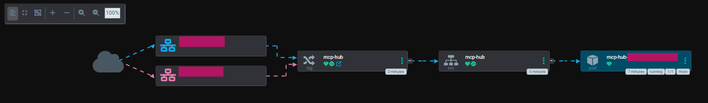

# mcp-hub-helm-template
> [!CAUTION]
**Work in Progress**: We are currently exploring ways to operate normally.

## Introduce


This repository is designed to make it easy to distribute [link](https://github.com/ravitemer/mcp-hub?tab=readme-ov-file)s.<br/>
If you are looking for mcp repository, [here](https://github.com/mcp?utm_source=pytorchkr&ref=pytorchkr).

## Start
### Clone
```bash
git clone https://github.com/ravitemer/mcp-hub.git
git clone https://github.com/PJW2004/mcp-hub-helm-template.git
```
### Build
```bash
docker build --no-cache -t container-registry-url/mcp-hub:latest -f mcp-hub-helm-template/Dockerfile ./mcp-hub
```
### Container Registry Push
```bash
docker push container-registry-url/mcp-hub:latest
```
### Deploy (Argo Cd)
[example](./helm/values.yaml)
### MCP Connect
reference : [link](https://code.claude.com/docs/ko/mcp#%EC%98%B5%EC%85%98-1%3A-%EC%9B%90%EA%B2%A9-http-%EC%84%9C%EB%B2%84-%EC%B6%94%EA%B0%80)
```bash
claude mcp add --transport http mcphub http://server-url/mcp
```
### MCP DisConnect
```bash
claude mcp remove mcphub
```